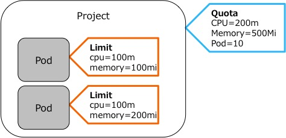
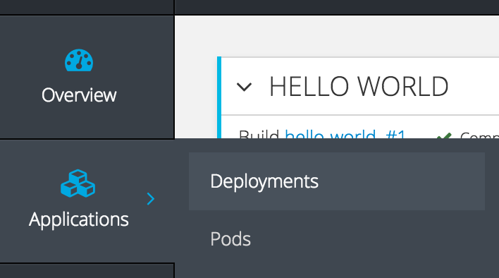

# オートスケール
オートスケールを有効にするための設定を行います。

## Quota, Limit

### Quota
プロジェクトに設定する利用可能なリソース使用量のハード制約

### Limit
Pod/Container に設定する必要なリソース使用量




## Holizontal Pod Auto Scaler

## アプリケーションのデプロイ
1. 管理Webにログイン
`https://<利用環境のURL>:8443`にアクセス。

2. プロジェクトの作成  
「New Project」ボタンをクリックしてプロジェクト作成ウィザードを開始。

3. プロジェクト名の設定
「New Project」画面でNameフィールドに「autoscale」と入力し、「Create」ボタンをクリック。

4. PHPのイメージストリームを選択
テンプレート一覧から「php:5.x - latest」を選択。

5. SCMを指定
Nameにアプリケーション名、Git Repository URL に`https://github.com/akubicharm/php-hello-world`を入力し、「Create」ボタンをクリック。

6. Deploymentsの表示
左側のPaneから「Applicaation -> Deloyment」を選択して、Deloyment一覧を表示。Deployment一覧から対象のDeloymentをクリック。

**オートスケールを有効にするために、CPU requestが必須**

7. リソースリミットの設定  
Deployments画面の右上の「Actions」プルダウンメニューから「Set Resource Limits」を選択。

Resource Limits画面で、CPU、MemoryのRequest/Limitの値を入力し、「Save」ボタンをクリック。

|種類|Request|Limit|
|---|---|---|
|CPU|100m|200m|
|Memory|200MiB|400MiB|

8. オートスケーラーの設定
Deployments画面の右上の「Actions」プルダウンメニューから「Add Autoscaler」を選択。


Autoscale deploymentsの設定画面で、パラメータを設定し、「Save」ボタンをクリック。

|パラメータ|値|
|---|---|
|Autoscaler Name|（デフォルトのまま）|
|Min Pods|1|
|Max Pods|4|
|CPU Request Target|10|


## オートスケールを実験
クライアントから作成したアプリケーションにアクセスし、スケールアウトすることを確認。

```
import threading, time, urllib2

def getHtml(url):
    response = urllib2.urlopen(url)  
    html = response.read()
    print(html)

appUrl = appUrl = '<アプリケーションのURL>'
threads = []

#getHtml(appUrl)

for i in range(10000):
    thread = threading.Thread(target=getHtml, args=(appUrl,))
    thread.start()
    threads.append(thread)

for thread in threads:
    thread.join()

print('Complete')
```


## LimitRange
LimitRangeは、クラスタ管理者が各プロジェクトで利用可能なリソースの制限を与えることができる
