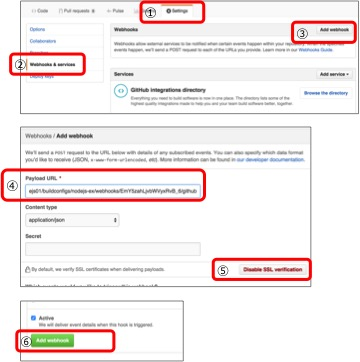

# Continuous integration

In OpenShift, there is a function to realize automation of build / deploy with trigger of webhook of Git repository.
In this case, we will use continuous application of hello-php application.

## Preparing the Git project
1. Fork  
https://github.com/akubicharm/php-hello-world

## Build and deploy the application
### Creating a project
1. Login to Administration Web  
Access `https://<URL of the use environment>`.

2. Create a project  
Click the "New Project" button to start the project creation wizard.

3. Set the project name  
On the New Project screen, enter "helloci" in the Name field and click the "Create" button.

### Build and deploy PHP application
1. Choose template  
Select "php: 5.x - Latest" from the template list.

2. Create pod  
Enter 'world' in the Name field, 'https://github.com/[YOUR_ACCOUNT]/php-hello-world' in the Git Repository URL and click 'Create' button

3. Confirm build and deployment  
On the "Next Steps" screen click on the link `Continue to overview`.

4. Verify build log  
Click the "View Log" link and check the build log.

### Confirmation of Webhook URL

1. Select BuildConfig  
Select "Builds> Builds" from the left side Pane
Select BuildConfig "Wolrd" from BuildConfig list

2. Confirm Webhook URL  
Display the "Configuration" tab on the right side Pane and copy "GitHub webhook URL"

### Setting up Github

1. Select the "settings" tab
2. Select "Webhooks"
3. Click the "Add webhook" button
4. Paste the copied OpenShift GitHub webhook URL into "Payload URL"
5. Click "Disable SSL Verification" button
6. Click the "Add webhook" button

### Update source code
1. Display the Overview in the management Web
Display the overview of the helloci project so that the reflection of changes can be seen
2. Edit index.php
3. Commit changes
