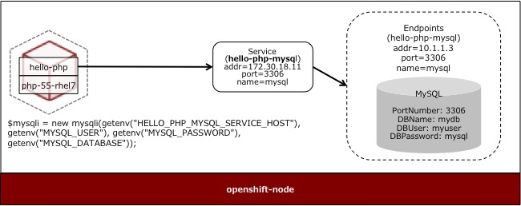

# Deploy complex applications
Web application and database cooperation

**the purpose**  
Understand service.

## Cooperation of PHP and MySQL
Pods in the same project are referred to by using the service name.
The service name can be referred to by environment variable `[service name]_SERVICE_HOST`. If the service name is hello-php-mysql, it is `HELLO_PHP_MYSQL_SERVICE_HOST`.

## Components to use
* php: 5.x (use the template which is Latest)
* mariadb-ephemeral (MariaDB without using persistent storage)

Deploying sample application is using `https://github.com/akubicharm/hello-php`.

## Build and deploy the application

### Creating a project
1. Login to Administration Web  
Access `https://<URL of the use environment>`.

2. Create a project  
Click the "New Project" button to start the project creation wizard.

3. Setting the project name  
In the New Project screen, enter "hello" in the Name field and click the "Create" button.

### Build and deploy PHP application
4. Specify template  
Select "php: 5.x - Latest" from the template list.

5. Create Pod  
Enter "world" in the Name field, "https://github.com/akubicharm/hello-php" in the Git Repository URL, click "Create" button

6. Confirm build and deployment
On the "Next Steps" screen click on the link `Continue to overview`.

7. verify Build log  
Click the "View Log" link and check the build log.

8. Visit Application  
Click the "Overview" tab in the left pane of the Administration Web to display a summary of the project. In the right pane, click the application's public URL to access the application.  
** Now, PHP error message is displayed because database is not set **

### Deploying the database

1. Add Components  
Click the "Add to project" button on the right of the project name on the management Web.

2. Choose template  
Select "mysql-ephemeral" from the template list.

3. Set parameters  
Set the parameters and click "Create" button.

| Parameter | Value |
| --- | --- |
| Database Service Name | hello-php-mysql |
| MySQL Connection Username | myuser |
| MySQL Connection Password | mypass |
| MySQL Databaes Name | mydb |

### Setting environment variables for PHP Pod

1. Select Deployment Config  
Select "Applications-> Deployments" in the left pane of the administration web and select "world" from the Deployments list in the right pane.

2. Set environment variables  
Select the "Environment" tab in the right pane of the administration web. On the Environment screen, set the environment variable and click "Save" button.

| Name | Value |
| --- | --- |
| MYSQL_USER | myuser |
| MYSQL_PASSWORD | mypass |
| MYSQL_DATABASE | mydb |

** PHP Pod will be restarted **

3. Visit your application
