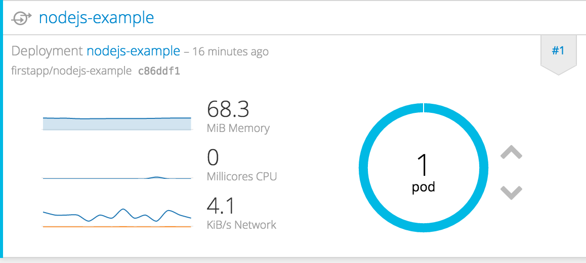

# Deploy the Instant App

Deploy instant application using OpenShift template.

**the purpose**  
Understand how to create projects and applications

## Build and deploy the application
1. Login to Administration Web  
Access `https://<URL of usage environment>`.

2. Create a project  
Click the "New Project" button to start the project creation wizard.

3. Setting the project name  
On the New Project screen, enter "firstapp" in the Name field and click the "Create" button.

4. Select instant application  
Select "nodejs-example" from the template.

5. Create  
Click the "Create" button at the bottom of the screen.

6. Execyte build and deployment  
On the "Next Steps" screen click on the link `Continue to overview`.

7. Verify Log
Click the `View Log` link and check the build log.

Finally, if `Push successful` is displayed, creation of Docker Image and registration to Docker Registration are completed.

8. Visit your application   
Click the "Overview" tab in the left pane of the Administration Web to display a summary of the project.
Click the application's public URL in the right pane to access the application.

## Using the management Web
### Verify Pod

Click the icon of Pod to display detailed information of Pod.

## Try operation of replication controller
### Scale up and down  
Click the "^" button which on the right of the pod icon.

### Self Healing
Click the Pod icon and select a pod on Pod list. Select "Delete" from the "Actions" pull-down at the top right of the screen and delete Pod.

The status of the deleted Pod becomes "Running" -> "Terminating", and finally it is deleted from the list. Instead, a new Pod is started.
