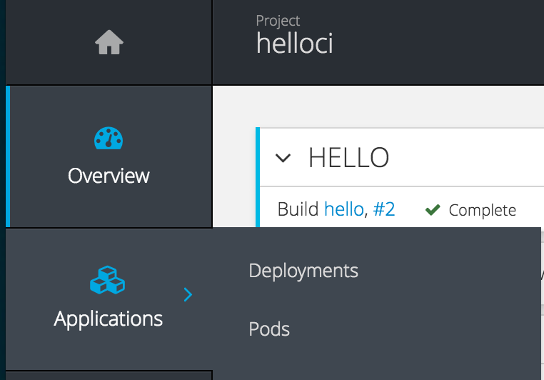
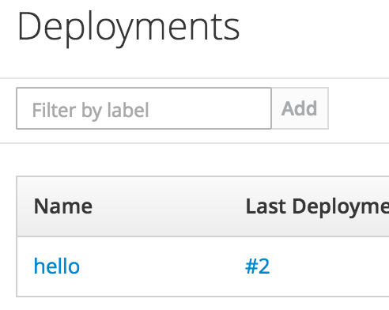
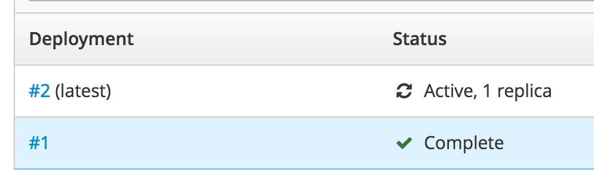
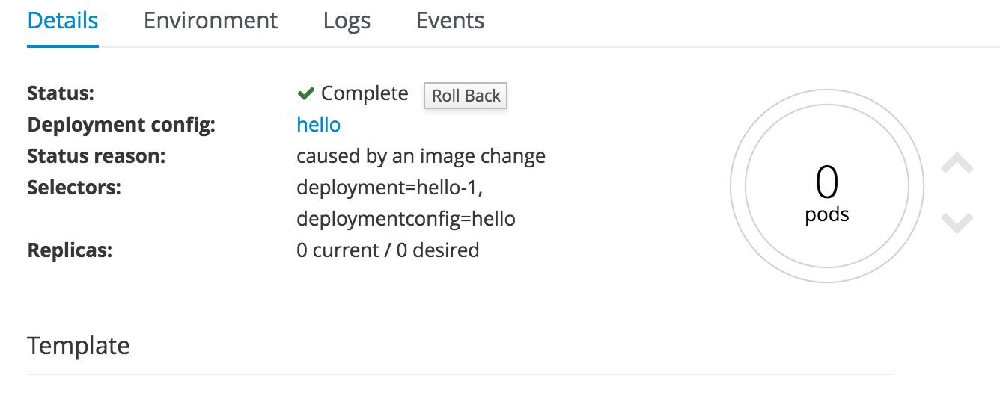
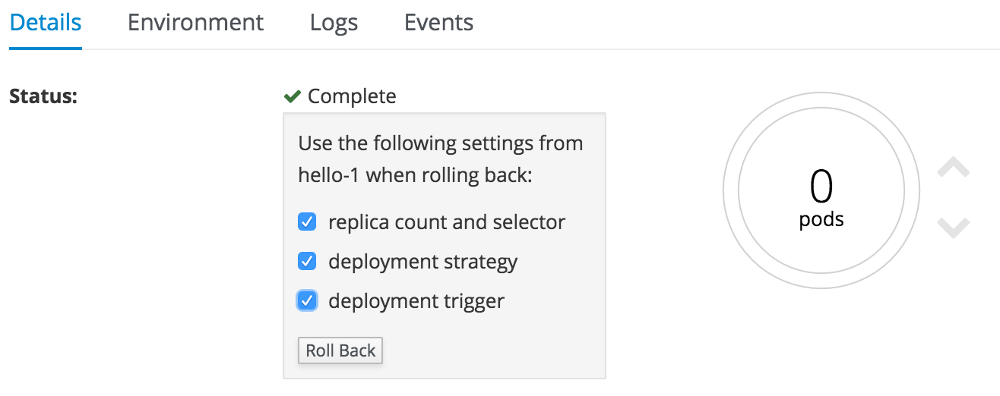

# rollback application

Refer to [continuousIntegration](../continuousIntegration/continuousIntegration.md) and deploy the application.

## Set environment variables
Rollback function can rollback not only container images but also environment variables. To understand this function, at first,set  environment variables with Deployment Config.

1. Select Deployment  
In the Pane on the left, select Applications -> Deployments and display the Deployment list. Select "hello" to display details of Deployment

2. Set environment variables  
On the details tag of the right side Pane, select the "Environment" tab, set environment variables, click "Save" button.

|Name|Value|
|---|---|
|GREETINGS|Hello|

## Set up rollback

1. Display DeploymentConfig  
Select Application -> Deployments from Pane on the left and select "hello" from the list of Deployments displayed.



2. Select the version of Deployment Config to be Rollbacked  
Scroll down the details screen of Deployment Config and select the version of Deployment to be rolled back.


3. Rollback  
Click the "Rollback" button, check the checkbox of rollback setting, click "Roll back" button.



4. Confirmation  
Select overview on the left side Pane and confirm roll back.


** Caution **  
As you roll back, the Build & Deploy trigger is disabled, so you need to enable it again


```
$ oc rollback hello - to - version = 1
# 5 rolled back to hello-1
Warning: the following images triggers were disabled: hello: latest
  You can re-enable them with: oc deploy hello --enable-triggers -n helloci
```
