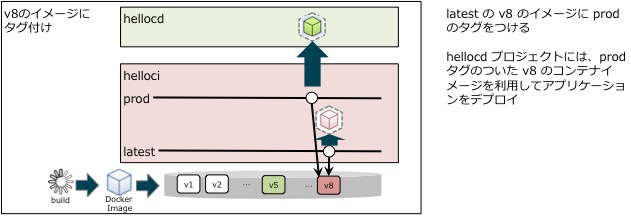

# 継続的デリバリー

`helloci` プロジェクトで作成したコンテナのイメージをプロダクション用プロジェクト (hellocd) でデプロイします。


**目的**
* 異なるプロジェクトで作成したイメージをデプロイする方法を理解する

## Container Image
コンテナイメージを作成し、 Docker Registry に登録する際、次のメタデータが付与されます。
* namespace
* name
* tag
* image


**タグは 作成したイメージにバージョンやリビジョンなど (タグ自体の命名規則は任意に指定可能) を付与するためのラベルに相当します。**

## Image Stream
Docker Registry にプッシュされたイメージをデプロイする際、 OpenShift の Image Stream が タグ付けされたイメージとの Registry 内の イメージを関連付けます。




Image Stream が参照できるオブジェクトは次のとおりになります。
* OpenShift のビルダーでビルドした同一プロジェクト内のイメージ
* 他の Image Stream
* 外部の Docker Registry で配布されている Docker Image


## Hands-on
### イメージのタグ付け

1. Master へのログイン
```
oc login https://<利用環境のURL>:8443/
```

1. プロジェクトの選択
```
oc project helloci
```

1. プロダクション用のタグ付け  
helloci プロジェクトの Image Stream に、プロダクション用のタグ (prod)を付与する。

```
oc tag helloci/world:latest helloci/world:prod
```

タグ (prod)が付与されている場合、次のコマンドから確認することができます。
```
$ oc get imagestreamtag
NAME           DOCKER REF                                                                                                 UPDATED          IMAGENAME
world:latest   172.30.188.224:5000/helloci/world@sha256:663bf7e9a7c9cc8495976461a3f9f676114fd678d3828425880ba7f7a2f1a3d6  2 minutes ago    sha256:663bf7e9a7c9cc8495976461a3f9f676114fd678d3828425880ba7f7a2f1a3d6
world:prod     172.30.188.224:5000/helloci/world@sha256:663bf7e9a7c9cc8495976461a3f9f676114fd678d3828425880ba7f7a2f1a3d6  21 seconds ago   sha256:663bf7e9a7c9cc8495976461a3f9f676114fd678d3828425880ba7f7a2f1a3d6
```

### プロダクション用プロジェクトの作成
1. Web Console へのログイン
`https://<利用環境のURL>:8443/console/` にアクセスする。

1. プロジェクトの作成
`New Project` ボタンをクリックし、プロジェクト作成ウィザードを開始する。
次の値を入力し、 `Create` ボタンをクリックする。

|フィールド|値|
|---|---|
|Name|hellocd|

1. Image Stream の選択
画面上部のタブ `Add to Project` > `Deploy Image` > `Image Stream Tag` を選択する。
helloci のプロジェクトで作成した `helloci/world:prod` の Image Stream を指定する。


**Policy 設定のコマンドが表示されます。**

1. ポリシーの設定
表示されたポリシー設定のコマンドを CLI で実行する。
```
oc policy add-role-to-user system:image-puller system:serviceaccount:hellocd:default -n helloci
```

```
oc policy add-role-to-user view [USERNAME] -n helloci
```

上記のコマンドは Role (`system:image-pullers`) を hellocd プロジェクトの ServiceAccount (system:serviceaccount:hellocd:default) に付与しています。
Role が付与されていることは次のコマンドから確認することができます。
```
$ oc get rolebinding system:image-pullers -o yaml -n helloci
apiVersion: v1
groupNames:
- system:serviceaccounts:helloci
kind: RoleBinding
metadata:
  creationTimestamp: 2017-03-27T02:10:33Z
  name: system:image-pullers
  namespace: helloci
  resourceVersion: "18518"
  selfLink: /oapi/v1/namespaces/helloci/rolebindings/system:image-pullers
  uid: 8f512439-1292-11e7-897a-2cc2602f8794
roleRef:
  name: system:image-puller
subjects:
- kind: ServiceAccount
  name: default
  namespace: hellocd
- kind: SystemGroup
  name: system:serviceaccounts:helloci
userNames:
- system:serviceaccount:hellocd:default
```

1. アプリケーションのデプロイ
`Create` ボタンをクリックしてアプリケーションをデプロイする。

1. Route の作成
`Create Route` をクリックする。
次の値を入力し、 `Create` ボタンをクリックする。

|名前|値|
|---|---|
|Name|world (デフォルトのまま）|
|Hostname|（入力なし）|
|Path|（入力なし）|
|Service|world |
|Target Port|8080->8080(TCP)（デフォルトのまま）|

1. 公開用 URL (Route) への接続
サンプルアプリケーションのページが表示されることを確認する。

### Image Stream の更新

1. Master へのログイン
```
oc login https://<利用環境のURL>:8443/
```

1. プロジェクトの選択
```
oc project helloci
```

1. タグの更新
```
oc tag helloci/world:latest helloci/world:prod
```

1. タグの更新確認
```
oc get imagestreamtag  world:prod
```

`UPDATED` が更新されていることを確認します。
```
NAME         DOCKER REF                                                                                                  UPDATED         IMAGENAME
world:prod   172.30.188.224:5000/helloci/world@sha256:72f87e6eeedfe270011b5b1f8cca99213e4a91131a0c39aaca1f84275068e28f   6 seconds ago   sha256:72f87e6eeedfe270011b5b1f8cca99213e4a91131a0c39aaca1f84275068e28f
```

1. デプロイの確認

`hellocd` プロジェクトにデプロイしたアプリケーションの `REVISION` が更新されていることを確認します。
```
oc get dc -n hellocd
```

出力例
```
NAME      REVISION   DESIRED   CURRENT   TRIGGERED BY
world     3          1         1         config,image(world:prod)
```

1. アプリケーションの更新確認

ブラウザから `hellocd` プロジェクトにデプロイしたアプリケーションの公開 URL を開き、更新したアプリケーションが表示されることを確認します。

```
oc get route world -n hellocd
```

出力例
```
NAME      HOST/PORT                                        PATH      SERVICES   PORT       TERMINATION
world     world-hellocd.cloudapps-03de.oslab.opentlc.com             world      8080-tcp
```

