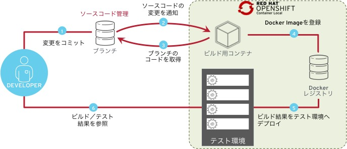
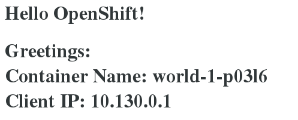
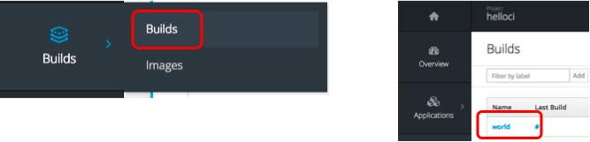
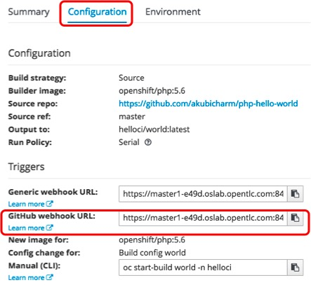
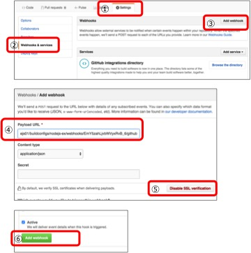

# 継続的インテグレーション

OpenShift では Git リポジトリの Webhook をトリガーにビルドやデプロイを実行することができます。

**目的**
* Webhook の設定方法を理解する



## 利用するテンプレート
* PHP (5.x Latest)
サンプル用のアプリケーションに `https://github.com/akubicharm/php-hello-world` を利用します。


## Hands-on
## Git プロジェクトの準備

`https://github.com/akubicharm/php-hello-world` をフォークします。

### アプリケーションのデプロイ

1. Web Console へのログイン
 `https://<利用環境のURL>:8443/console` にアクセスする。

1. プロジェクトの作成
 `New Project` ボタンをクリックして、プロジェクト作成ウィザートを開始する。
次の値を入力し、 `Create` ボタンをクリックする。

|フィールド|値|
|---|---|
|Name|helloci|

1. カタログの選択
一覧から「PHP (Verion 5.x - Latest)」を選択し、 `Select` をクリックする。
次の値を入力し、 `Create` ボタンをクリックする。

|フィールド|値|
|---|---|
|Name|world|
|Git Repository URL|https://github.com/[YOUR_ACCOUNT]/php-hello-world

1. ビルドとデプロイの確認
`Next Steps` 画面で `Continue to overview` リンクをクリックする。

1. ビルドログの確認
`View Log` のリンクをクリックし、Docker Image のビルドログを確認する。

1. ビルドログ確認  
`View Log` のリンクをクリックし、ビルドログを確認する。

### アプリケーションの動作確認

1. 公開用 URL (Route) への接続

```
curl $(oc get route helloworld --template='{{ .spec.host }}')
```

公開 URL にブラウザで接続する場合、次のページが表示されます。
`Container Name` と `Client IP` は環境により異なります。


### Webhook URL の確認

1. BuildConfig の選択
左側の Pane `Builds` > `Builds` を選択し、一覧から `world` をクリックする。


2. Webhook URL の確認
`Configuration` タブをクリックし、 `GitHub Webhook URL` の値をコピーする。


### Github Webhook の設定

1. ブラウザで `https://github.com/<YOUR_ACCOUNT>/php-hello-world` を表示
1. `Settings` タブを選択する。
1. `Webhooks` を選択する。
1. `Add webhook` ボタンをクリックする。
1. `Payload URL` に コピーした OpenShift の `GitHub webhook URL` をペーストする。
1. `Content type` に `application/json` を選択する。
1. `Disable SSL Verification` ボタンをクリックする。
1. `Add webhook` ボタンをクリックする。




** `Content type` に `application/json` を選択しない場合、 OpenShift の Master API は 500 を返し、 Webhook の受信に失敗します。**

### ソースコードの更新

1. Overview の表示
ソースコードをコミットした際、変更の反映が目視できるように、 `helloci` プロジェクトの Overview ページを表示する。

1. ソースコードの修正
```
git clone https://github.com/<YOUR_ACCOUNT>/php-hello-world
cd php-hello-world/
vi index.php
```

ここでは、 HTML の一部を修正しています。
```
$ git diff index.php
diff --git a/index.php b/index.php
index 0746483..922fa41 100644
--- a/index.php
+++ b/index.php
@@ -1,5 +1,5 @@
 <?php
-echo "<h1>Hello OpenShift!<h1>";
+echo "<h1>Hello OpenShift! CI test<h1>";
 echo "Greetings:";
 echo getenv("GREETINGS");
 echo "<br>";
```

1. リポジトリへのプッシュ
```
git commit index.php -m 'First commit'
git push origin mastr
```

1. Webhook の確認

リポジトリにコミットをプッシュした後、 OpenShift の Web Console から ビルドの履歴 (Last Builds)が更新されていることを確認します。
[アプリケーションの動作確認](#アプリケーションの動作確認) と同じ手順で、公開しているアプリケーションが更新されていることを確認します。
