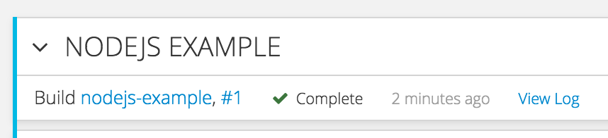
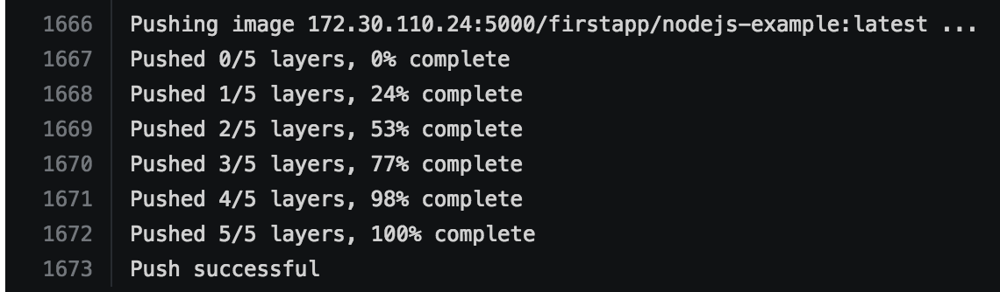
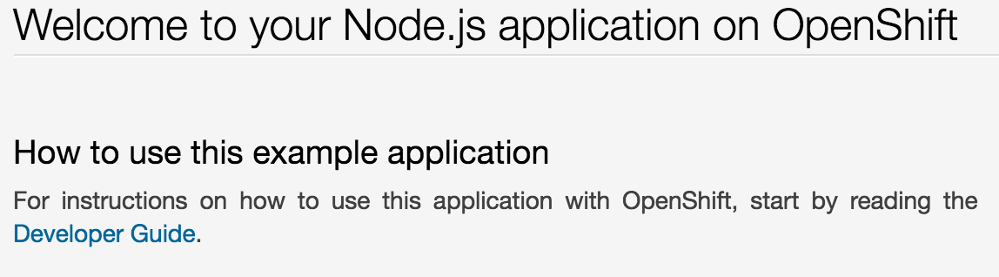
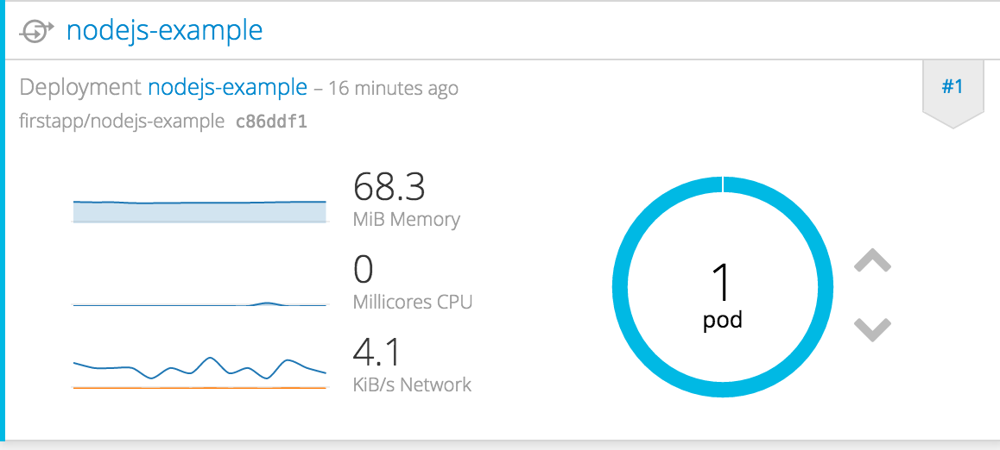
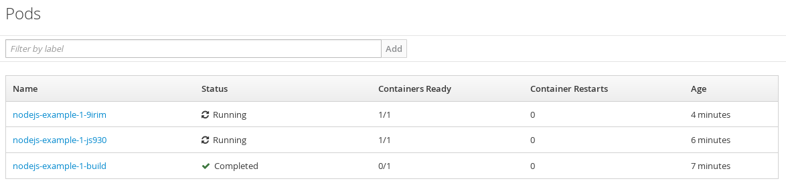
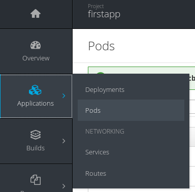
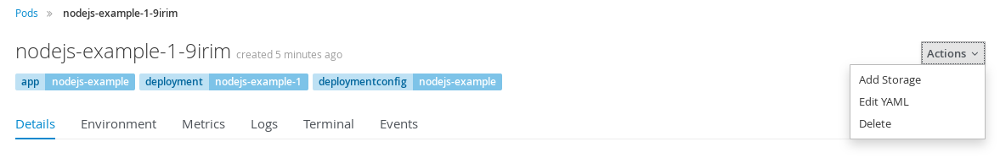

# シンプルなアプリケーションのデプロイ
OpenShift がデフォルトで提供するクイックスタートテンプレートを利用し、サンプル用のWebアプリケーションをデプロイします。

**目的**
* プロジェクトの作成方法を理解する
* アプリケーションのデプロイ方法を理解する

## 利用するテンプレート
* JavaScript - Node.js (4.x latest)

## Hands-on
### アプリケーションのデプロイ

1. Web Console へのログイン
`https://<利用環境のURL>:8443/console/` にアクセスする。

1. プロジェクトの作成
`New Project` ボタンをクリックし、プロジェクト作成ウィザードを開始する。
次の値を入力し、 `Create` ボタンをクリックする。

|フィールド|値|
|---|---|
|Name|firstapp|

1. テンプレートの選択
一覧から `JavaScript` > `Node.js` を選択し、 `Select` をクリックする
次の値を入力し、`Create` ボタンをクリックする。

|フィールド|値|
|---|---|
|Name|nodejs-example|
|Git Repository URL|https://github.com/openshift/nodejs-ex.git|

1. ビルドとデプロイの確認  
`Next Steps` 画面で `Continue to overview` のリンクをクリックする。

1. ビルドログの確認  
`View Log` のリンクをクリックし、Docker Image のビルドログを確認する。

ログの末尾に **Push successful** と表示されていれば、Docker Image の作成と作成した Image を Docker Registry への登録 (Push)が完了します。

1. アプリケーションの動作確認  
左側のペイン `Overview` タブをクリックし、右側のペインのアプリケーションの公開 URL をクリックし、アプリケーションにアクセスする。

アプリケーションが正常にデプロイされている場合、次のページが表示されます。

### Pod のスケールアップ

1. Pod のスケールアップ
Pod の台数が表示されているアイコン右の `^` をクリックし、 Pod をスケールアップする。

1. スケールアップの確認
左側のペイン `Applications` > `Pods` を選択する。

スケールアップが正常に完了している場合、 指定の台数に Pod が増えていることを確認できます。

### セルフヒーリングの確認

1. Pod の選択
左側のペイン `Applications` > `Pods` を選択する。

1. Pod の削除
Pod の一覧が表示され、任意の Pod を選択する。

画面右上の `Actions` プルダウンから `Delete` を選択、 Pod を削除する。

削除した Pod の状態が `Running` から `Terminating` となり、削除と同時に新たな Pod が起動されます。
削除された Pod は一定期間後、一覧から削除されます。
