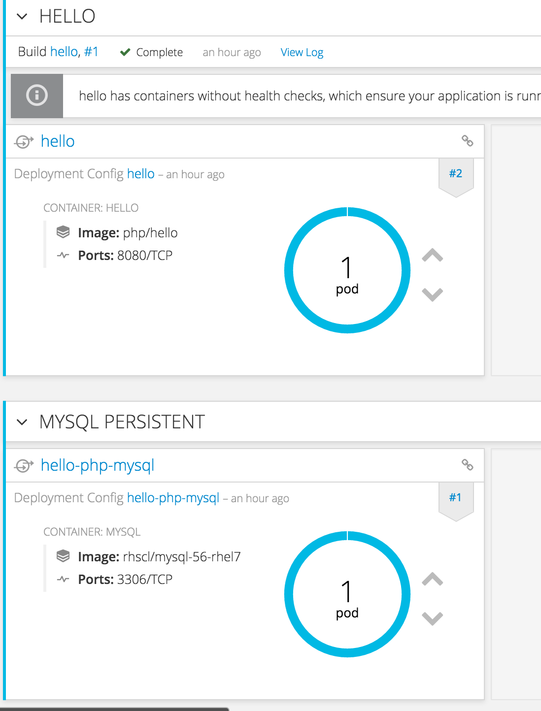
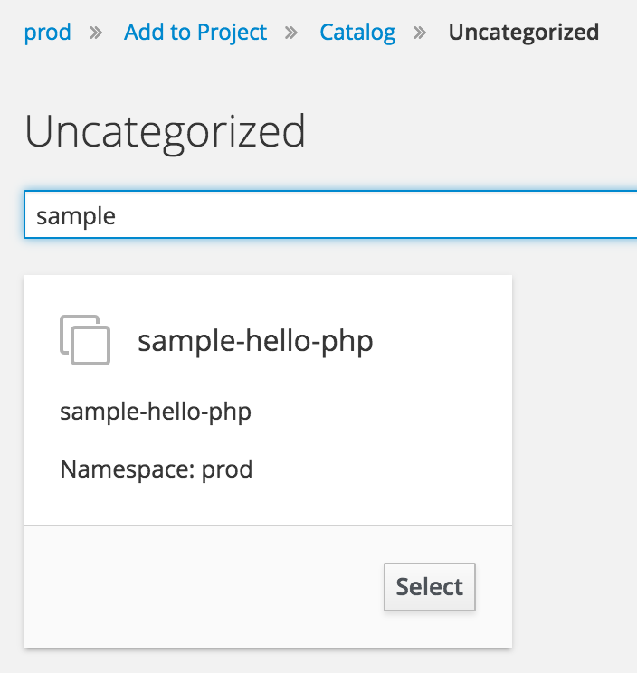

# テンプレート

テンプレートでは、アプリケーションのビルドやデプロイの設定などを定義します。テンプレートを活用することで、環境の標準化が容易に実現できるようになります。

OpenShift全体で利用可能なテンプレートは openshift という名前空間に登録されていますので、登録済みのテンプレートは次のコマンドで取得できます。
```
oc get templates -n openshift
```

ここでは、デプロイ済みの php-mysql のアプリケーションからテンプレートを作成して登録、利用します。

## 既存プロジェクトからテンプレートの作成


* HELLO
 * PHPのコンテナ
 * Web App として公開するための Route が設定済み
* MYSQL_PERSISTENT
 * 永続化ストレージを利用する MYSQL のコンテナ


作成済みのプロジェクトの Application Image を利用して他のプロジェクトへデプロイするためのテンプレートを、oc export コマンドを利用して作成します。
export の対象は以下の通りです。
* deploymentConfig
* routes
* service
* persystent volume claim

※新たにDocker Imageの作成はしないので BuildConfig は不要です。

```
oc export dc/hello dc/hello-php-mysql routes/hello svc/hello  svc/hello-php-mysql pvc/hello-php-mysql --as-template=sample-hello-php -o yaml > sample-hello-php.yaml
```

export した sample-hello-php.yaml には、元にしたプロジェクト固有の情報が含まれているので、少し修正します。

* 変更 1 : HELLO (PHPコンテナ)のdeploymentConfig
 * image で指定されている、docker image の詳細を削除
 * デプロイのトリガーとなっている image の tag を hello:latest から hello:prod に変更

```
  kind:deploymentConfig
  ... 中 略 ...
  spec:
    ... 中　略 ...
    image: ←ここの記述を削除
    ... 中 略 ...
    triggers:
    - imageChangeParams:
        automatic: true
        containerNames:
        - hello
        from:
          kind: ImageStreamTag
          name: hello:prod  ←ここを hello:latest から変更
          namespace: php
      type: ImageChange
```

* 変更 2 : MYSQL_PERSISTENT (MYSQLコンテナ)のdeploymentConfig
  * image で指定されている、docker image の詳細を削除

```
  kind: DeploymentConfig
  spec:
  ... 中　略 ...
      spec:
      ... 中　略 ...
          image: ←ここの記述を削除
```

* 変更 3 : Route
 * アプリケーションを公開する URL が元のプロジェクトと重複するので変更

```
  kind: Route
  ... 中　略 ...
    spec:
      host: prod-php.40.74.119.81.xip.io ←ここの記述をhello-php...から変更
      ... 中略 ...
    status:
      ingress:
      ... 中略 ...
        host: prod-php.40.74.119.81.xip.io ←ここの記述をhello-php...から変更
```

* 変更 4 : Persistent Volume Claim
 * MYSQL の永続ストレージの割り当てステータスを削除
  * metadata.name 以外を削除
  * spec.volumeName を削除

```
kind: PersistentVolumeClaim
metadata:
  name: hello-php-mysql
spec:
  accessModes:
  - ReadWriteOnce
  resources:
    requests:
      storage: 1Gi
status: {}
```

詳細は、sample-hello-php.yamlを参照

## テンプレートを使ってアプリケーションをデプロイ
1. プロジェクトの作成
```
oc new-project prod
```
2. テンプレートの登録
```
oc create -f sample-hello-php.yaml
```
3. テンプレートを選択


アプリケーションのRoute の設定と、MYSQL のコンテナがデプロイされました。
まだ、PHPのコンテナはデプロイされていません。

## tag 付けをしてPHPアプリケーションをデプロイ
1. 他のプロジェクトのImageの参照権限を付与　　
prodプロジェクトのdefaultサービスアカウントに、phpプロジェクトで作成された、Docker Imageをpullする権限を付与します。
```
oc policy add-role-to-user system:image-puller system:serviceaccount:prod:default -n php
```
2. タグ付け
```
oc tag php/hello:latest prod/hello:prod
```
