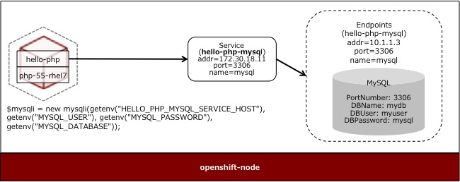
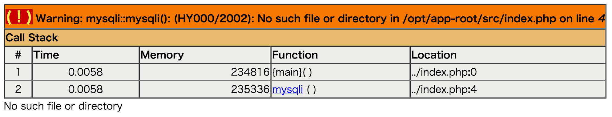
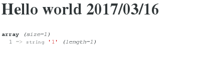

# 複雑なアプリケーションのデプロイ
2-Tier 構成の Web アプリケーションとデータベースをデプロイします。

**目的**
* Web アプリケーションとデータベースの接続方法を理解する
* Pod 間の通信に用いる [Service] の用途を理解する

## 利用するテンプレート
* PHP (7.x Latest)
サンプル用のアプリケーションに `https://github.com/akubicharm/hello-php` を利用します。

* MySQLDB (Ephemeral)
DB のデータ領域に揮発性ストレージを利用します。
Pod が再起動するとデータは削除されます。

## [Service]について
同じプロジェクト内で、例えば、Web アプリケーションからデータベースを参照する場合、 Service を指定し、 Pod 同士を通信させます。
サービス名は Pod に対し `[service name]_SERVICE_HOST` という名称で環境変数が定義されます。
例えば、サービス名が `hello-php-mysql` の場合、環境変数は `HELLO_PHP_MYSQL_SERVICE_HOST` となります。

## Hands-on
### アプリケーションのデプロイ

1. Web Console へのログイン
 `https://<利用環境のURL>:8443/console` にアクセスする。

1. プロジェクトの作成
 `New Project` ボタンをクリックして、プロジェクト作成ウィザートを開始する。
次の値を入力し、 `Create` ボタンをクリックする。

|フィールド|値|
|---|---|
|Name|hello|

1. カタログの選択
一覧から「PHP (Verion 7.x - Latest)」を選択し、 `Select` をクリックする。
次の値を入力し、 `Create` ボタンをクリックする。

|フィールド|値|
|---|---|
|Name|world|
|Git Repository URL|https://github.com/akubicharm/hello-php|

1. ビルドとデプロイの確認
`Next Steps` 画面で `Continue to overview` リンクをクリックする。

1. ビルドログの確認
`View Log` のリンクをクリックし、Docker Image のビルドログを確認する。

1. アプリケーションの動作確認
左側のペイン `Overview` タブをクリックし、右側のペインのアプリケーションの公開 URL をクリックし、アプリケーションにアクセスする。

**この時点では、データベースが設定されていないため、 PHP のエラーメッセージが表示されます。**

1. カタログの選択
管理Webのプロジェクト名の右隣の `Add to project` ボタンをクリックする。
`Data Stores` > `MySQL (Ephemeral)` を選択する。

1. パラメータの設定
パラメータに次の値を入力し、 `Create` ボタンをクリックする。

|パラメータ|値|
|---|---|
|Database Service Name|hello-php-mysql|
|MySQL Connection Username|myuser|
|MySQL Connection Password|mypass|
|MySQL Databaes Name|mydb|

### 環境変数の設定

1. デプロイメントコンフィグ (DeploymentConfig)の選択
Web Console の左側のペインから `Applications` > `Deployments` を選択する。
Deployments の一覧から `world` を選択する。

1. 環境変数の設定
`Environment` タブを選択する。
次の値を入力し、 `Save` ボタンをクリックする。

|Name|Value|
|---|---|
|MYSQL_USER|myuser|
|MYSQL_PASSWORD|mypass|
|MYSQL_DATABASE|mydb|

**環境変数を設定すると、 Pod が再起動されます。**

### アプリケーションの動作確認

1. 公開用 URL (Route) への接続
左側のペイン `Overview` タブをクリックし、右側のペインのアプリケーションの公開 URL をクリックし、アプリケーションにアクセスする。

PHP アプリケーションから DB への接続が成功している場合、次のように表示されます。

[Service]: https://docs.openshift.com/container-platform/latest/architecture/core_concepts/pods_and_services.html#services
