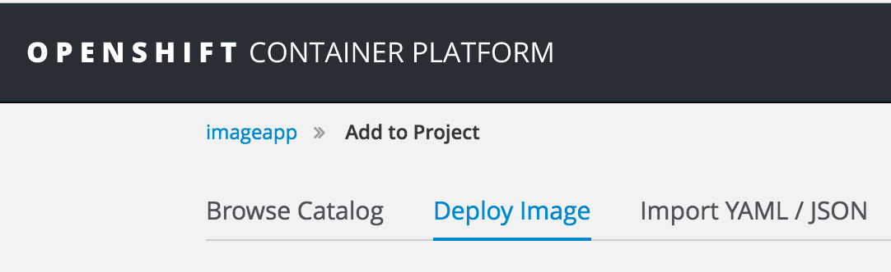
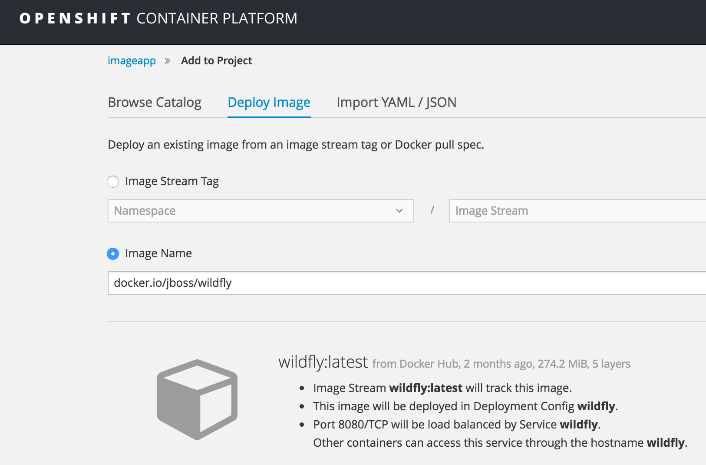
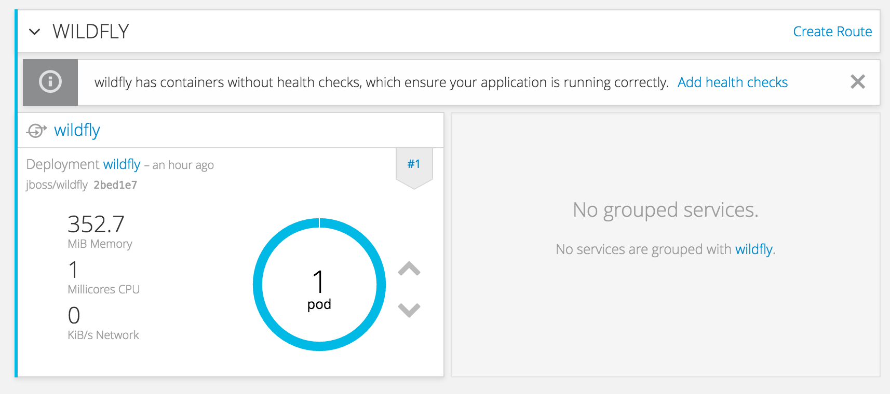
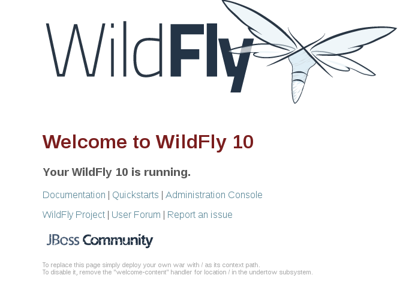

# Docker Image を使ったアプリケーションのデプロイ
Docker Image を利用して、アプリケーションをデプロイします。

**目的**  
- Security Context Constraints
- Service Account
- Policy  
を理解する。

## 利用する Docker Image
* WildFly <docker.io/jboss/wildfly>

## Hands-on
### アプリケーションのデプロイ

1. Web Console へのログイン
 `https://<利用環境のURL>:8443/console` にアクセスする。

1. プロジェクトの作成
`New Project` ボタンをクリックして、プロジェクト作成ウィザートを開始する。
次の値を入力し、 `Create` ボタンをクリックする。

|フィールド|値|
|---|---|
|Name|imageapp|

### Policy の設定
Master サーバに SSH でログインし、 次のコマンドを実行する。
**Policy の設定は Web Console でなく、 CLI を利用します。**
```
oc login -u system:admin
oc adm policy add-scc-to-group anyuid system:serviceaccounts:imageapp
```

※Wildflyのコンテナイメージは anyuid の SCC 設定は不要になった

1. デプロイ方式の選択
`Add to Project` 画面上部のタブで `Deploy Image` を選択する。


1. Image の選択
`ImageName` を選択し、 `docker.io/jboss/wildfly` を入力し、 `Enter` を押す。


`ImageName` に 外部 Registry の pull spec を指定する場合、 指定の Registry から Image を検索します。

1. アプリケーションのデプロイ
画面下部の `Create` ボタンをクリックする。

1. デプロイの確認
`Continue to overview` のリンクをクリックする。

1. Route の作成
`Create Route` をクリックする。

次の値を入力し、 `Create` ボタンをクリックする。

|名前|値|
|---|---|
|Name|wildfly (デフォルトのまま）|
|Hostname|（入力なし）|
|Path|（入力なし）|
|Service|wildfly（デフォルトのまま）|
|Target Port|8080->8080(TCP)（デフォルトのまま）|

** デプロイ方式の選択に Docker Image を指定する場合、クイックスタート用テンプレートとは異なり、アプリケーションにアクセスするための公開 URL (Route) は自動で作成されません。そのため、 Route を手動で作成します。**

** Hostname を指定しない場合、_<アプリケーション名>-<プロジェクト名>.<デフォルトのサブドメイン名>_  でURLが生成されます。**

1. アプリケーションにアクセス
`Overview` 画面に表示された URL をクリックしてアプリケーションにアクセスする。

Route が正常に作成されている場合、次のように表示されます。


### SCC 設定が必要なアプリケーションのデプロイ
1. DeployImageを洗濯
2. docker.io/gitlab/gitlab-ce を指定
3. Routeの作成（80番ポートをマッピング）
