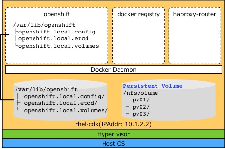

# 利用環境
## サーバ環境（Vagrantで実行する仮想サーバ）
* OpenShift Local(Red Hat Container DevelopmentKit 2.2)で、Master/Nodeがall-in-oneインストールされた、コンテナ版のOpenShiftを利用します。Vagrantファイル内で「PUBLIC_ADDRESS=10.1.2.2」と指定されています。別のIPアドレスを利用したい場合は、Vgrantファイルを編集してください。
* OSEユーザ
 * OpenShift Localでは、以下の2つのユーザが準備されています。
   * User: openshift-dev, Password:DevelopmentKit
   * User: admin, Password: admin

## クライアント環境（OpenShift Localを実行するホストOS）
 ブラウザ、OpenShift CLIツール(oc コマンド)のインストールが必要です。

## コンポーネント構成


* Host OS からrhel-cdk環境いへのログイン方法
```
% vagrant ssh
```

* rhdl-cdk環境でrootになる方法
```
% sudo -i
```
