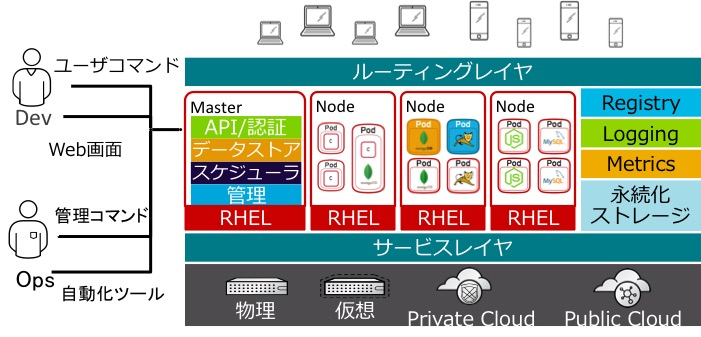
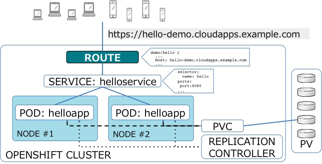

# 基本的な概念

## インフラ

## コアオブジェクト

## Pod
コンテナの入れ物であり、デプロイするユニットとなるKubernetesのオブジェクト。OpenShift上ではアプリケーションやMySQLなどのコンテナがそれぞれpodになる。
k8s Pod

## Service (svc)
pod群のIPアドレスを保持し、podへのアクセスポイントとなるKubernetesのオブジェクト
k8s Service

## Replication Controller (rc)
podの数を管理して制御するKubernetesのオブジェクト
k8s Replication Controller

## Deployment Config (dc)
デプロイ管理を行うOpenShiftのオブジェクト

## Build Config (bc)
ビルド管理を行うOpenShiftのオブジェクト

## Image Stream (is)
イメージ管理を行うOpenShiftのオブジェクト。タグはそれぞれ追記専用リスト(Stream)のような構造になっており、イメージの履歴 を参照できる。イメージは実際にはDocker Registryに保存されており、Image Streamはイメージを保持しているわけではなくイメージを参照するための情報のみを保持している。

## Route
ルーター設定を行うOpenShiftのオブジェクト。OpenShiftのHAProxyルーターコンポーネントの設定情報を保持する。Routeを作成すると、OpenShift外部からサービスへURLアクセス可能になる。oc exposeコマンドで作成できる。
