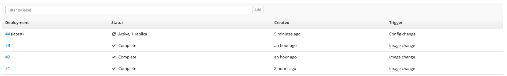
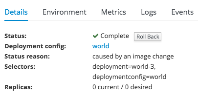
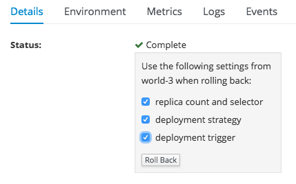

# アプリケーションの世代管理
デプロイしたアプリケーションを指定の世代にロールバックします。

**目的**
* ロールバックの範囲に DeploymentConfig に設定した環境変数が含まれることを理解する

## Hands-on
### 事前準備
[continuousIntegration](../continuousIntegration/continuousIntegration.md)　を参照して、アプリケーションをデプロイします。

### 環境変数の設定

1. Web Console へのログイン
`https://<利用環境のURL>:8443/console` にアクセスする。

1. プロジェクトの選択
`helloci` プロジェクトを選択する。

1. Deployment の選択
左側の Pane `Applications` > `Deployments` を選択、一覧から `world` を選択する。

1. 環境変数の設定
`Environment` タブを選択し、次の値を入力し、 `Save` をクリックする。

|Name|Value|
|---|---|
|GREETINGS|Hello|

1. 環境変数の確認
最新バージョンの Deployments から `Environment` タブを選択し、環境変数が適用されていることを確認する。

### ロールバックの設定

1. Deployment バージョンの指定
`Details` タブを選択し、Deployment のバージョンを指定する。

**ここでは `#3` を指定しています。**

1. Rollback の実行
`Roll Back` ボタンをクリック、ロールバックの設定のチェックボックスをチェックし、`Roll Back` ボタンをクリックする。

1. ロールバックの確認
左側の Pane `Applications` > `Deployments` > `world` から最新の Deploy バージョンを選択する。
`Environment` タブをクリックし、環境変数が設定されていないことを確認する。

