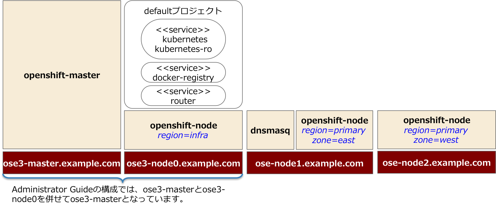

# はじめに

## 参考資料
https://access.redhat.com/documentation/ja-JP/OpenShift_Enterprise/
インストール手順は Administrator Guide を参照してください。

## インストール作業で必要な前提知識
* yum
* git
* ansible
* systemd

## インストールする構成
* ose3-master.example.com
* ose3-node0.example.com
* ose3-node1.example.com
* ose3-node2.example.com

※インストールガイドでは、Master サーバをインフラ用 Node としても利用しています。

このインストール手順書では、 https://github.com/openshift/openshift-ansible を利用して
インストールすることを前提としています。
この方式でインストールした場合、ユーザ認証は htpasswd での認証に設定されます。
認証方式の変更は https://access.redhat.com/beta/documentation/en/openshift-enterprise-30-administrator-guide#configuring-authentication を参照してください。

---
# インストール

インストール対象の全てのサーバで実施します。

## Subscriptionの有効化

* 実行ユーザ: root
* 実行サーバ: Master、Node 全て

    [root@ose3-master ~]# subscription-manager register

    [root@ose3-master ~]# subscription-manager attach

    [root@ose3-master ~]# subscription-manager repos --disable="*"
    [root@ose3-master ~]# subscription-manager repos \
     --enable="rhel-7-server-rpms" \
     --enable="rhel-7-server-extras-rpms" \
     --enable="rhel-7-server-optional-rpms" \
     --enable="rhel-7-server-ose-3.0-rpms"

## パッケージのインストール
* 実行ユーザ：root
* 実行サーバ：Master

## ネットワーク設定が自動的に変更されないように、Network Manager を停止
    [root@ose3-master ~]# yum remove NetworkManager *

## 必要なパッケージをインストール
    [root@ose3-master ~]# yum install wget git net-tools bind-utils iptables-services bridge-utils

## パッケージのアップデート
    [root@ose3-master ~]# yum update

# Docker のインストール
* 実行ユーザ: root
* 実行サーバ: Master

## docker パッケージインストール
    [root@ose3-master ~]# yum install docker

## /etc/sysconfig/docker の編集
OPTIONSプロパティで、`insecure-registory` として利用できるサブネットを指定

File = /etc/sysconfig/docker

    OPTIONS=--selinux-enabled --insecure-registry 172.30.0.0/16

## doker の再起動
    [root@ose3-master ~]# systemctl restart docker

## docker のステータス確認
    [root@ose3-master ~]# systemctl status docker
    docker.service - Docker Application Container Engine
       Loaded: loaded (/usr/lib/systemd/system/docker.service; enabled)
       Active: active (running) since 木 2015-07-02 21:03:20 JST; 1h 26min ago
         Docs: http://docs.docker.com
     Main PID: 1152 (docker)
       CGroup: /system.slice/docker.service
               └─1152 /usr/bin/docker -d --selinux-enabled --insecure-registry 172.30.0.0/16 --add-registry registry.access.redhat.com

## DockerStorageの設定
検証環境の構築では、やりません。
※ただし、パフォーマンス測定などの目的がある場合は、ストレージの設定も考慮してください。　

---
# 公開鍵の設定
* 実行ユーザ: root
* 実行サーバ: Master サーバ

##  公開鍵の作成

    [root@ose3-master ~]# ssh-keygen
    Generating public/private rsa key pair.
    Enter file in which to save the key (/root/.ssh/id_rsa):  ← リターンを入力
    Created directory '/root/.ssh'.
    Enter passphrase (empty for no passphrase):  ← リターンを入力
    Enter same passphrase again:  ←  リターンを入力
    Your identification has been saved in /root/.ssh/id_rsa.
    Your public key has been saved in /root/.ssh/id_rsa.pub.
    The key fingerprint is:
    72:7e:9c:61:7a:f1:af:f5:c6:ad:7d:c0:b9:c7:77:a3 root@ose3-master
    The key's randomart image is:
    +--[ RSA 2048]----+
    |                 |
    |                 |
    |                 |
    |                 |
    |      . S +  . . |
    |       + + =  +  |
    |        o = . .=.|
    |         o   o.+X|
    |            .E++B|
    +-----------------+

## 公開鍵の配布
    [root@ose3-master ~]# for host in ose3-master.example.com \
     ose3-node1.example.com \
     ose3-node2.example.com; \
    do ssh-copy-id -i ~/.ssh/id_rsa.pub $host; \
     done

---
#  ansible のインストール
* 実行ユーザ: root
* 実行サーバ: Master

##  パッケージの有効化
    [root@ose3-master ~]# yum -y install http://dl.fedoraproject.org/pub/epel/7/x86_64/e/epel-release-7-5.noarch.rpm

## yum リポジトリの設定変更
ansible をインストールするため、epel のYUMレジストリを有効にします

    [root@ose3-master ~]# sed -i -e "s/^enabled=1/enabled=0/" /etc/yum.repos.d/epel.repo

【変更前】
    
    [epel]
    name=Extra Packages for Enterprise Linux 7 - $basearch
    #baseurl=http://download.fedoraproject.org/pub/epel/7/$basearch
    mirrorlist=https://mirrors.fedoraproject.org/metalink?repo=epel-7&arch=$basearch
    failovermethod=priority
    enabled=1
    gpgcheck=1
    gpgkey=file:///etc/pki/rpm-gpg/RPM-GPG-KEY-EPEL-7

【変更後】
    
    [epel]
    name=Extra Packages for Enterprise Linux 7 - $basearch
    #baseurl=http://download.fedoraproject.org/pub/epel/7/$basearch
    mirrorlist=https://mirrors.fedoraproject.org/metalink?repo=epel-7&arch=$basearch
    failovermethod=priority
    enabled=0
    gpgcheck=1
    gpgkey=file:///etc/pki/rpm-gpg/RPM-GPG-KEY-EPEL-7

## ansible パッケージのインストール
    [root@ose3-master ~]# yum -y --enablerepo=epel install ansible

##  ansible リポジトリのクローン
Github で公開されている、ansible インストーラを取得します。

    [root@ose3-master ~]# cd ~
    [root@ose3-master ~]# git clone https://github.com/openshift/openshift-ansible
    [root@ose3-master ~]# cd openshift-ansible
    [root@ose3-master ~]# git checkout -b 3.x v3.0.0

## /etc/ansible/hosts の準備
※※※マニュアルだと、deployment_typeの設定が抜けている。
Master、Node は実環境のFQDN に併せて編集してください。

File = /etc/ansible/hosts

    # To deploy origin, change deployment_type to origin
    deployment_type=enterprise
    
    # host group for masters
    [masters]
    ose3-master.example.com openshift_hostname="ose3-master.example.com"

    # host group for nodes, includes region info
    [nodes]
    #ose3-master.example.com openshift_node_labels="{'region': 'infra', 'zone': 'default'}"
    ose3-node0.example.com openshift_node_labels="{'region': 'infra', 'zone': 'default'}" openshift_hostname="ose3-node0.example.com"
    ose3-node1.example.com openshift_node_labels="{'region': 'primary', 'zone': 'east'}" openshift_hostname="ose3-node1.example.com"
    ose3-node2.example.com openshift_node_labels="{'region': 'primary', 'zone': 'west'}" openshift_hostname="ose3-node2.example.com"

## インストール
    [root@ose3-master ~]# ansible-playbook ~/openshift-ansible/playbooks/byo/config.yml

## label の確認
    [root@ose3-master ~]# oc get nodes
    NAME                     LABELS                                                                    STATUS
    ose3-node0.example.com   kubernetes.io/hostname=ose3-node0.example.com,region=infra,zone=default   Ready
    ose3-node1.example.com   kubernetes.io/hostname=ose3-node1.example.com,region=primary,zone=east    Ready
    ose3-node2.example.com   kubernetes.io/hostname=ose3-node2.example.com,region=primary,zone=west    Ready

### Nodeのプロパティを yaml 形式で取得
`oc get nodes` で Node サーバに `regizon` と `zone` が設定されていない場合、`oc edit` コマンドで追加してください。
追加内容は以下の通りです。

### インフラ用Node

以下の2行を追加

    region: infra
    zone: default

※インデントに意味があるので、インデントは間違えないように注意してください。

    [root@ose3-master ~]# oc edit node <node名> --output='yaml'

【変更前】

    apiVersion: v1
    kind: Node
    metadata:
      creationTimestamp: 2015-07-02T21:20:46Z
      labels:
        kubernetes.io/hostname: ose3-node0.example.com

【変更後】

    apiVersion: v1
    kind: Node
    metadata:
      creationTimestamp: 2015-07-02T21:20:46Z
      labels:
        kubernetes.io/hostname: ose3-node0.example.com
        region: infra
        zone: default

### アプリケーション用Node 1

以下の2行を追加

    region: primary
    zone: east

    [root@ose3-master ~]# oc edit node <node名> --output='yaml'

【変更前】

    apiVersion: v1
    kind: Node
    metadata:
      creationTimestamp: 2015-07-02T21:20:46Z
      labels:
        kubernetes.io/hostname: ose3-node1.example.com

【変更後】

    apiVersion: v1
    kind: Node
    metadata:
      creationTimestamp: 2015-07-02T21:20:46Z
      labels:
        kubernetes.io/hostname: ose3-node1.example.com
        region: primary
        zone: east

### アプリケーション用Node 2

以下の2行を追加

    region: primary
    zone: east

    [root@ose3-master ~]# oc edit node <node名> --output='yaml'

【変更前】

    apiVersion: v1
    kind: Node
    metadata:
      creationTimestamp: 2015-07-02T21:20:46Z
      labels:
        kubernetes.io/hostname: ose3-node2.example.com

【変更後】

    apiVersion: v1
    kind: Node
    metadata:
      creationTimestamp: 2015-07-02T21:20:46Z
      labels:
        kubernetes.io/hostname: ose3-node2.example.com
        region: primary
        zone: west

---
# DNS設定
ここではDNSMasqでのDNS設定方法を示します。
ose3-node0 に DNSMasq を設定します。
Master サーバでは、内部的に利用するべつのDNSサーバが稼働しているので、Master サーバ以外で
DNSMasq または DNSサーバを動かしてください。

ネーミングサービスを提供するサーバは53ポートが利用できる必要がありますので、`iptables`コマンドで53番ポートを解放します。

    [root@ose3-node0 ~]# iptables -I INPUT -p tcp --dport 53 -j ACCEPT
    [root@ose3-node0 ~]# iptables -I INPUT -p udp --dport 53 -j ACCEPT
    [root@ose3-node0 ~]# service iptables save
    [root@ose3-node0 ~]# cat /etc/sysconfig/iptables

※firewall コマンドを利用する場合
    firewall-cmd --add-port=53/tdp
    firewall-cmd --add-port=53/udp

#### 参考
https://github.com/openshift/training/blob/master/beta-4-setup.md#appendix---dnsmasq-setup

---
# Docker Registry の作成
STIビルドなどで作成した Docker Image を保持するための、Docker Registory を作成する

* 実行ユーザ: root
* 実行サーバ: Master

## registry 作成
    [root@ose3-master ~]# oadm registry --config=/etc/openshift/master/admin.kubeconfig \
    --credentials=/etc/openshift/master/openshift-registry.kubeconfig \
    --images='registry.access.redhat.com/openshift3/ose-${component}:${version}'

以下の2行が出力される

    deploymentconfigs/docker-registry
    services/docker-registry

## pods の確認
    [root@ose3-master ~]# oc get pods
    NAME                      READY     REASON    RESTARTS   AGE
    docker-registry-1-2zcdy   1/1       Running   0          5m

## ログ確認
    [root@ose3-master ~]# oc logs docker-registry-1-2zcdy
    time="2015-07-14T07:44:08-04:00" level=info msg="version=v2.0.0+unknown" 
    time="2015-07-14T07:44:08-04:00" level=info msg="redis not configured" instance.id=5783b6dc-8cd1-4aa5-8b6f-7b3399691f15 
    time="2015-07-14T07:44:08-04:00" level=info msg="using inmemory layerinfo cache" instance.id=5783b6dc-8cd1-4aa5-8b6f-7b3399691f15 
    time="2015-07-14T07:44:08-04:00" level=info msg="Using OpenShift Auth handler" 
    time="2015-07-14T07:44:08-04:00" level=info msg="Starting upload purge in 9m0s" instance.id=5783b6dc-8cd1-4aa5-8b6f-7b3399691f15 
    time="2015-07-14T07:44:08-04:00" level=info msg="listening on :5000" instance.id=5783b6dc-8cd1-4aa5-8b6f-7b3399691f15 

### トラブルシューティング
Docker Registry 作成時に以下のようなエラーが発生した場合は、Docker Registry を作成するNodeサーバの `/etc/sysconfig/docker`  を確認し `OPTIONS=--selinux-enabled --insecure-registry 172.30.0.0/16` となっていることを確認してください。

    # oc get pods
    NAME                      READY     REASON    RESTARTS   AGE
    docker-registry-1-zzgu8   0/1       image pull failed for registry.access.redhat.com/openshift3/ose-docker-registry:v3.0.0.1, this may be because there are no credentials on this request.  details: (API error (500):  v1 ping attempt failed with error: Get https://registry.access.redhat.com/v1/_ping: dial tcp: i/o timeout. If this private registry supports only HTTP or HTTPS with an unknown CA certificate, please add `--insecure-registry registry.access.redhat.com` to the daemon's arguments. In the case of HTTPS, if you have access to the registry's CA certificate, no need for the flag; simply place the CA certificate at /etc/docker/certs.d/registry.access.redhat.com/ca.crt

## お試しユーザ作成
    [root@ose3-master ~]# useradd joe
    [root@ose3-master ~]# htpasswd -b /etc/openshift/openshift-passwd joe redhat
    Adding password for user joe

---
# Router の設定
* 実行ユーザ: root
* 実行サーバ: Master

## Router の確認
    [root@ose3-master ~]# oadm router --dry-run \
    --credentials='/etc/openshift/master/openshift-router.kubeconfig' \
    --images='registry.access.redhat.com/openshift3/ose-${component}:${version}'

## ルータ作成の書式
    [root@ose3-master ~]# oadm router <router_name> --replicas=<number> \
    --credentials='/etc/openshift/master/openshift-router.kubeconfig' \
    --images='registry.access.redhat.com/openshift3/ose-${component}:${version}'

    [root@ose3-master ~]# oadm router myrouter --replicas=1 \
    --credentials='/etc/openshift/master/openshift-router.kubeconfig' \
    --selector='region=infra' \
    --images='registry.access.redhat.com/openshift3/ose-${component}:${version}'
    password for stats user admin has been set to OpbX3WGiik
    deploymentconfigs/myrouter
    services/myrouter

## ルータの確認
    [root@ose3-master ~]# oadm router myrouter -o yaml \
    --credentials='/etc/openshift/master/openshift-router.kubeconfig' \
    --images='registry.access.redhat.com/openshift3/ose-${component}:${version}'

## どのホストにデプロイされているかを確認
    [root@ose3-master ~]# oc describe pods myrouter-1-630bf

