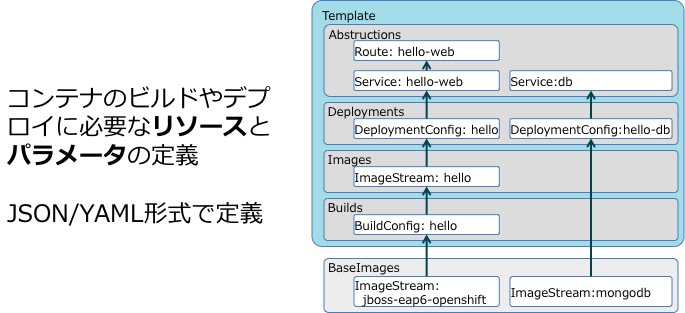

# アプリケーションのデプロイのハンズオン

## Table of Contents
* 重要な用語
* アプリケーションデプロイの仕組み
* テンプレート
* JBoss EAP テンプレートの利用

---
## 重要な用語


* Pod
+
コンテナのラッピングした概念で、デプロイする単位となるKubernetesのオブジェクト。OpenShift上ではアプリケーションやMySQLなどのコンテナがPodになる。[k8s Pod]

* Service (svc)
+
pod群のIPアドレスを保持し、podへのアクセスポイントとなるKubernetesのオブジェクト [k8s Service]

* ReplicationControler (rc)
+
podの数を管理して制御するKubernetesのオブジェクト [k8s Replication Controller]

* DeploymentConfig (dc)
+
デプロイ方式を定義するOpenShiftのオブジェクト

* BuildConfig (bc)
+
コンテナイメージのビルド方式を定義するOpenShiftのオブジェクト

* ImageStream (is)
+
イメージ管理を行うOpenShiftのオブジェクト。タグはそれぞれ追記専用リスト(Stream)のような構造になっており、イメージの履歴 を参照できる。イメージは実際にはDocker Registryに保存されており、Image Streamはイメージを保持しているわけではなくイメージを参照するための情報のみを保持している。

* Route
+
アプリケーションを公開する際のホスト名とサービスの関連を管理するOpenShiftのオブジェクト。OpenShiftのHAProxyルーターコンポーネントの設定情報を保持する。Routeを作成すると、OpenShift外部からサービスへURLアクセス可能になる。oc exposeコマンドで作成できる。


## アプリケーションのビルドとデプロイの仕組み

### ビルド方式
* S2I Build
OpenShift の S2I Builder コンテナを利用して、Runtime + アプリケーションのコンテナをビルドする仕組み

* Docker Build
Dockerfile を指定して、コンテナをビルドする仕組み

* Pipeline Build
Jenkins Pipeline で定義した方式にしたがってビルドやデプロイをする仕組み

## Template


Service, BuildConfig, DeploymentConfig など、コンテナのビルドやデプロイに必要なリソース及び、それらのオブジェクトのパラメータを定義。
テンプレートは複数のコンテナアプリケーションの定義を記載することも可能。

## ImageStream と Template
OpenShift で用意された Builder Container を利用してアプリケーションのビルドを行う方法は複数のオプションある。

0. Builder Container を指定
0. テンプレートを指定
0. アプリケーションのソースコードリポジトリを指定

ビルド方式によって、指定可能なオプションも異なる。


JBoss EAP 7 を ImageStream を使ってデプロイする場合
アプリケーション名や、ソースコードリポジトリはOpenShift の CLI のオプションで指定。
```
oc new-app --strategy=source jboss-eap70-openshift~https://github.com/jboss-developer/jboss-eap-quickstarts#7.0.0.GA --context-dir=kitchensink
```

JBoss EAP 7 のテンプレートを利用する場合
テンプレートのパラメータ定義にしたがってオプションを指定。
ex) eap70-basic-s2i の場合
```
oc new-app --template=eap70-basic-s2i --param=APPLICATION_NAME=myapp
```

## JBoss EAP テンプレートの利用
JBoss EAP の S2I Builder では、/usr/local/s2i/ ディレクトリにあるスクリプトにより、テンプレートで定義されたパラメータにしたがって standalone-openshift.xml を作成し、JBoss EAP の起動時利用している。

## S2I の動作を変更する方法
S2I ビルダーは、assemble （コンテナイメージの作成）、run (コンテナの起動)をスクリプトで定義している。そのスクリプトを差し替えることで Builder Container を再定義しなくても動作を変更することが可能。(2)

* 方法1
+
ソースコードツリーに .sti/script ディレクトリを作成し、assemble, run な動作を変更したいスクリプトを保存する(1)

* 方法2
+
ビルドストラテジ定義で、s2i スクリプトを保存してあるソースコードリポジトリを指定する(3)
+
```
strategy:
  sourceStrategy:
    from:
      kind: "ImageStreamTag"
      name: "builder-image:latest"
    scripts: "http://somehost.com/scripts_directory"
```

### 参考
(1) https://docs.openshift.com/container-platform/3.6/creating_images/s2i.html#s2i-scripts

(2) https://docs.openshift.com/container-platform/3.6/using_images/s2i_images/customizing_s2i_images.html

(3) https://docs.openshift.com/container-platform/3.6/dev_guide/builds/build_strategies.html
